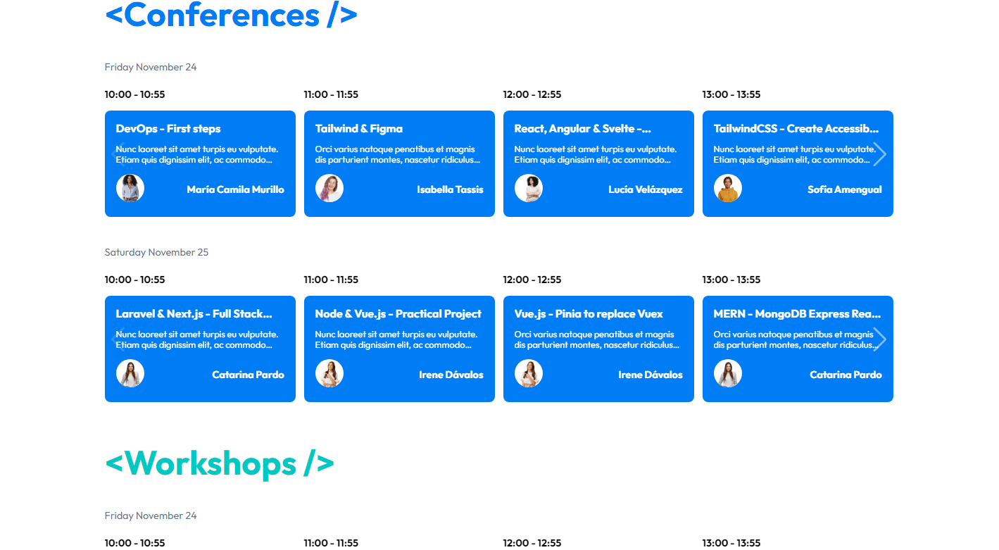

# **DevWebCamp**

## **Description**

DevWebCamp is a web application for Conferences and Workshops where registered people can access in person or virtually making a payment through PayPal.

Once the payment is made, they will choose up to 5 Conferences/Workshops to attend; It has an administration panel to create more events, speakers, gifts and view app statistics.

Try it by accessing with the public user `test12@test.com` and his password password123

---

## **Author**

    Jorge Torres

* **[Linkedin](https://www.linkedin.com/in/jorge-torres8/ "jorge-torres8")**

> **All my projects (including this one) are in my portfolio, visit [jorgetorres.com](https://www.holajorge.com "Portfolio") for more information.** //TODO

---

## **Demo App**

Take a look for yourself **[DevWebCamp.](http://devwebcampjt.domcloud.io/ "Deployment DevWebCamp")**

